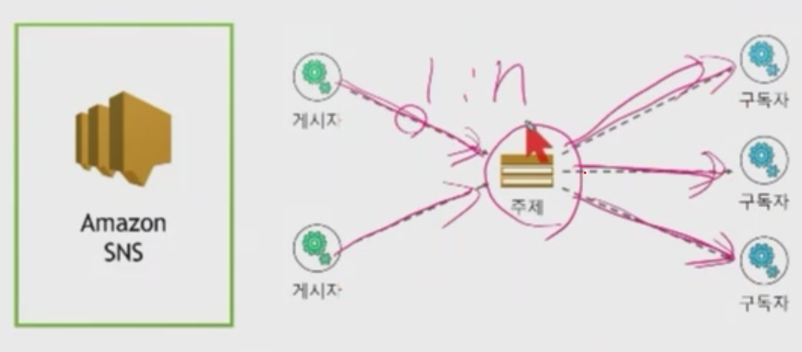

# Amazon SNS

  

    <figure>
        
        
<figcation>SNS 예제</figcation>

    </figure>
  

## SNS 사용 사례

- 어플리케이션 및 시스템 경보
- 푸시 이메일 및 문자 메시지
- 모바일 푸시 알림

## SNS 특성

- 하나의 게시된 메시지
- 리콜 옵션 없음
- HTTP/HTTPS 재시도
- 주문 및 전달 보장 X

## SNS 및 S3 응용(인스타그램)

  

    <figure>
        
        
<figcation>SNS S3 응용</figcation>

    </figure>
  

## SNS vs SQS

  

    <figure>
        
        
<figcation>SNS vs SQS</figcation>

    </figure>
  

