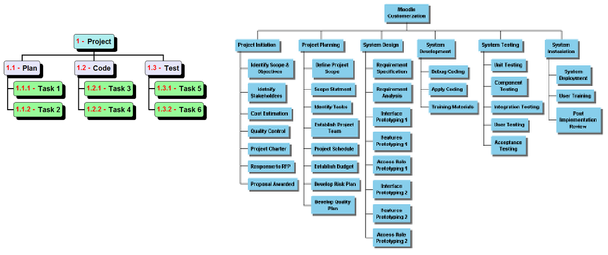
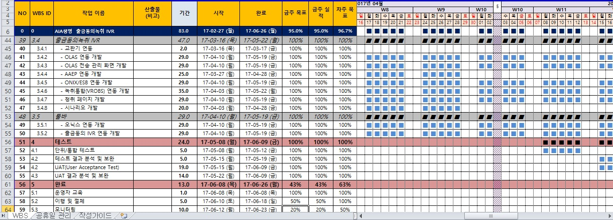

# WBS - Work Breakdown Structure

참조 - [링크](https://steemit.com/it/@sukjunko/sj-wbs)

 

## 목차

[1. 개념](#1-개념)

[2. 활용](#2-활용)

[3. 작성 방법](#3-작성-방법)

[4. 예시](#4-예시)

  

## 1. 개념

우리 말로 하면 '작업 분해도'

프로젝트 범위와 최종산출물을 세부요소로 분할한 계층 구조

프로젝트를 진행할 때, 업무사항을 Task(업무) 단위로 분류하여 일정을 관리하기 위한 문서이다.

일정을 관리할 때 프로젝트 리더와 매니저가 전체 일정 및 인력 관리가 용이하도록 도와준다. 또한, 각 담당자들은 프로젝트 방향과 진행 상황을 WBS로 파악하며 자신이 맡은 업무를 스케쥴링한다.

업무 단위로 분류하기 때문에 어떻게 업무를 추출해내는지에 따라 효율성이 달라질 수 있다.

  

## 2. 활용

전체 업무를 분류하여 구성 요소로 만든 후 각 요소를 일정에 따라 계획, 평가하고 이를 완수할 수 있는 사람에게 할당한다.

**프로세스**

1. 프로젝트에서 수행할 업무 식별
2. 일정, 원가, 자원 요구사항 파악
3. 일정 계획, 산정
4. 전체 일정 및 진행상황 파악
5. 고객, 팀 간 의사소통 링크

  

## 3. 작성 방법

1. 프로젝트 전체를 SRS 등을 작성해가며 큰 단위로 분할
2. 각 요구사항 등을 더 작은 단위로 분해하여 계층적으로 구성
3. 단위 패키징
4. 담당 인원 배치 구성도 작성

  

## 4. 예시

  

    <figure>
      
      

        <figcation>WBS 예시 1</figcation>
      

    </figure>
  

  

    <figure>
      
      

        <figcation>WBS 예시 2</figcation>
      

    </figure>
  

  

    <figure>
      
      

        <figcation>WBS 예시 3</figcation>
      

    </figure>
  

  