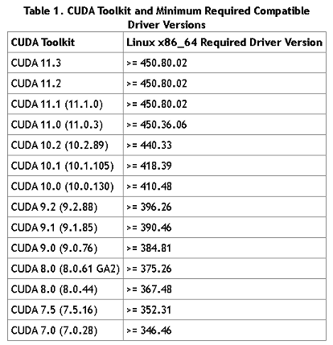
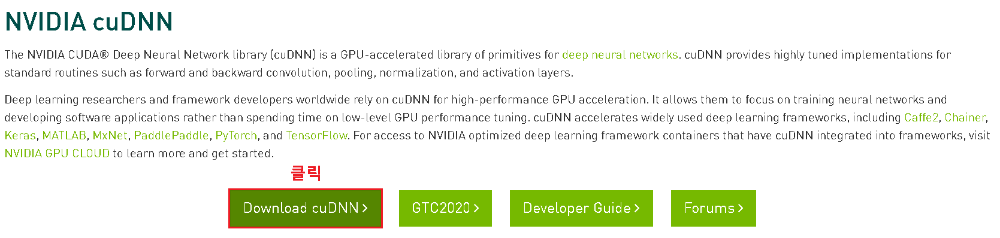
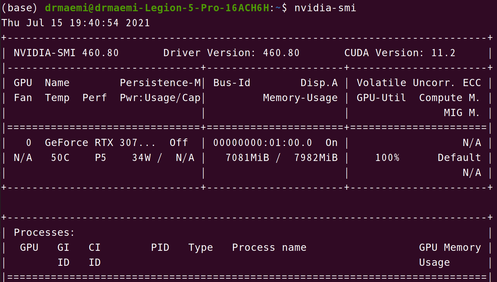

# CUDA 설치 방법
<p>NVIDIA GPU를 이용하는 CUDA를 설치하는 방법</p>

<br>

## 목차
<p>

[1. 윈도우](#1-윈도우)<br>
&nbsp; &nbsp; [1.1. CUDA 점수 확인](#11-CUDA-점수-확인)<br>
&nbsp; &nbsp; [1.2. NVIDIA 그래픽 드라이버 버전 확인](#12-NVIDIA-그래픽-드라이버-버전-확인)<br>
&nbsp; &nbsp; [1.3. CUDA Toolkit 다운로드](#13-cuda-toolkit-다운로드)<br>
&nbsp; &nbsp; [1.4. cuDNN 다운로드](#14-cudnn-다운로드)<br>
&nbsp; &nbsp; [1.5. cuDNN 라이브러리 DLL 등록](#15-cudnn-라이브러리-dll-등록)<br>
&nbsp; &nbsp; [1.6. 환경변수 확인](#16-환경변수-확인)
</p>
<p>

[2. WSL 2](#2-wsl-2)<br>
&nbsp; &nbsp; [2.1. 윈도우 참가자 프로그램 등록 및 업데이트](#21-윈도우-참가자-프로그램-등록-및-업데이트)<br>
&nbsp; &nbsp; [2.2. NVIDIA 드라이버 설치 for CUDA on WSL](#22-nvidia-드라이버-설치-for-cuda-on-wsl)<br>
&nbsp; &nbsp; [2.3. CUDA Toolkit 다운로드](#23-cuda-toolkit-다운로드)<br>
&nbsp; &nbsp; [2.4. CUDA 샘플 컨테이너 구동](#24-cuda-샘플-컨테이너-구동)<br>
&nbsp; &nbsp; [2.5. 환경변수 설정](25-환경변수-설정)<br>
&nbsp; &nbsp; [2.A. Anaconda 설치](2a-anaconda-설치)
</p>

<p>

[3. Linux - Ubuntu 20.04](#3-linux---ubuntu-2004)<br>
&nbsp; &nbsp; [3.1. NVIDIA 드라이버 설치](#31-nvidia-드라이버-설치)<br>
&nbsp; &nbsp; [3.2. CUDA Toolkit 다운로드](#32-cuda-toolkit-다운로드)<br>
&nbsp; &nbsp; [3.3. cuDNN 다운로드 및 등록](#33-cudnn-다운로드-및-등록)<br>
&nbsp; &nbsp; [3.4. 설치 확인](#34-설치-확인)
</p>

<br><br>

## 1. 윈도우

### 1.1. CUDA 점수 확인
<p>

자신의 NVIDIA GPU의 CUDA 점수를 확인한다.~~근데 이걸 왜 확인하는 거였지..? 내 GPU가 CUDA를 사용할 수 있나 없나 확인?~~<p>

<p>

[GPU 호환 CUDA 점수 확인 링크](https://developer.nvidia.com/cuda-gpus)
</p>

<br>

### 1.2. NVIDIA 그래픽 드라이버 버전 확인
<p>CUDA 설치 시 NVIDIA 그래픽 드라이버도 같이 설치한다. 충돌을 방지하고자 한다면 CUDA를 설치하기 전에 그래픽 드라이버를 삭제한 후 CUDA를 설치하는 것이 좋다.</p>

<p>그래픽 드라이버를 삭제하기 싫다면 본인이 사용해야 할 CUDA 버전과 호환되는 그래픽 드라이버 버전을 확인한다.</p>

<div align="center">
  <figure>
      
      <div align="center"><figcation>CUDA 호환 그래픽 드라이버 버전</figcation></div>
  </figure>
</div>

<br>

<p>내 엔비디아 그래픽 드라이버 버전도 확인한다. 엔비디아 제어판 > 좌측 하단의 시스템 정보 클릭 순으로 확인할 수 있다.</p>

<br>

### 1.3. CUDA Toolkit 다운로드
<p>확인이 모두 끝났다면 자신의 GPU에 맞는 CUDA Toolkit을 다운로드 받는다.</p>
<p>

[CUDA Toolkit 다운로드 링크](https://developer.nvidia.com/cuda-toolkit-archive)
</p>

<br>

### 1.4. cuDNN 다운로드

<p>그 다음 NVIDIA DEVELOPER 웹 사이트에 회원가입을 해야 cuDNN SDK를 다운받을 수 있다.</p>
<p>

[cuDNN 다운로드 링크](https://developer.nvidia.com/cudnn)
</p>

<p>
  <div align="center">
    <figure>
        
        <div align="center"><figcation>cuDNN SDK 다운</figcation></div>
    </figure>
  </div>
</p>

<br>

<p>
  <div align="center">
    <figure>
        
        <div align="center"><figcation>본인 CUDA Toolkit 버전에 맞게 다운</figcation></div>
    </figure>
  </div>
</p>

<br>

### 1.5. cuDNN 라이브러리 DLL 등록
<p>다운받은 cuDNN 라이브러리 내부 폴더들을 다운받은 CUDA Toolkit 경로 하에 복사하여 붙여넣는다.</p>

<p>
  <div align="center">
    <figure>
        
        <div align="center"><figcation>cuDNN 폴더 세 개 복사 후</figcation></div>
    </figure>
  </div>
</p>

<p>
  <div align="center">
    <figure>
        
        <div align="center"><figcation>CUDA Toolkit 내부 붙여넣기</figcation></div>
    </figure>
  </div>
</p>

<br>

### 1.6. 환경변수 확인
<p>CUDA Toolkit, cuDNN 설치 완료 후 환경변수가 제대로 설정되었는지 확인한다.</p>

<p>
  <div align="center">
    <figure>
        
        <div align="center"><figcation>CUDA 환경 변수 생성 확인</figcation></div>
    </figure>
  </div>
</p>

<p>

제대로 설정됐다면 CMD에 `nvcc --version` 입력 시 다음과 같이 동작함을 확인한다.
</p>

<p>
  <div align="center">
    <figure>
        
        <div align="center"><figcation>nvcc --version 동작 확인</figcation></div>
    </figure>
  </div>
</p>

<br><br>

## 2. WSL 2
<p>

참조
</p>
<p>

- [CUDA on WSL User Guide(NVIDIA Official)](https://docs.nvidia.com/cuda/wsl-user-guide/index.html)
- [윈도우 참가자 프로그램(Window Insider Program) 사용법](https://focuskr.tistory.com/238)
</p>
<p>

WSL 2 설치를 끝냈다고 가정하고 설명한다. 만약 WSL 2 설치가 되어있지 않다면 [문서](https://github.com/DrMaemi/Study/tree/master/Linux/1.%20설치%20방법#3-wsl-2) 참조</p>

<br>

### 2.1. 윈도우 참가자 프로그램 등록 및 업데이트
<p>WSL에서 CUDA를 사용하기 위해 반드시 윈도우 참가자 프로그램에 등록하고 윈도우를 업데이트해야 한다.</p>
<p>

[윈도우 참가자 프로그램 등록](https://insider.windows.com/en-us/getting-started#register)
</p>
<p>

위 링크에 접속해 `Register` 클릭 후 로그인, 프로그램에 계정을 등록한다.
</p>
<p>

그 후 **설정**에서 **업데이트 및 보안** → **Window 참가자 프로그램**에서 `시작` 클릭, `개발자 채널`로 사용하도록 설정한다.
</p>
<p>

**주의할 점** - 사용 설정이 끝나면 **반드시 윈도우 업데이트를 진행해야 한다.** ~~이것때문에 많이 삽질했다...~~
</p>

<br>

### 2.2. NVIDIA 드라이버 설치 for CUDA on WSL
<p>

이건 그냥 윈도우용 NVIDIA 드라이버를 사용해도 무방한데, 사용하고자 하는 CUDA 버전과 호환되어야 한다(본문 [1.2. NVIDIA 그래픽 드라이버 버전 확인](#12-nvidia-그래픽-드라이버-버전-확인) 참조)</p>
<p>

[다운로드 링크](https://developer.nvidia.com/cuda/wsl/download)
</p>

<br>

### 2.3. CUDA Toolkit 다운로드
<p>터미널</p>
<p>

```console
apt-key adv --fetch-keys http://developer.download.nvidia.com/compute/cuda/repos/ubuntu1804/x86_64/7fa2af80.pub
```
```console
sh -c 'echo "deb http://developer.download.nvidia.com/compute/cuda/repos/ubuntu1804/x86_64 /" > /etc/apt/sources.list.d/cuda.list'
```
```console
apt-get update
```
```console
apt-get install -y cuda-toolkit-11-2
```
</p>

<br>

### 2.4. CUDA 샘플 컨테이너 구동
<p>예제 실행</p>
<p>

```console
cd /usr/local/cuda/samples/4_Finance/BlackScholes
make
./BlackScholes
```
</p>
<p>

결과
```
Initializing data...
...allocating CPU memory for options.
...allocating GPU memory for options.
...generating input data in CPU mem.
...copying input data to GPU mem.
Data init done.

Executing Black-Scholes GPU kernel (131072 iterations)...
Options count             : 8000000
BlackScholesGPU() time    : 1.314299 msec
Effective memory bandwidth: 60.868973 GB/s
Gigaoptions per second    : 6.086897
```
</p>

<br>

<p>CUDA GPU 벤치 마킹(with docker)</p>
<p>

```console
curl https://get.docker.com | sh
```
```console
distribution=$(. /etc/os-release;echo $ID$VERSION_ID)
```
```console
curl -s -L https://nvidia.github.io/nvidia-docker/gpgkey | sudo apt-key add -
```
```console
curl -s -L https://nvidia.github.io/nvidia-docker/$distribution/nvidia-docker.list | sudo tee /etc/apt/sources.list.d/nvidia-docker.list
```
```console
curl -s -L https://nvidia.github.io/libnvidia-container/experimental/$distribution/libnvidia-container-experimental.list | sudo tee /etc/apt/sources.list.d/libnvidia-container-experimental.list
```
```console
sudo apt-get update
```
```console
sudo apt-get install -y nvidia-docker2
```
```console
sudo service docker stop
```
```console
sudo service docker start
```
```console
docker run --gpus all nvcr.io/nvidia/k8s/cuda-sample:nbody nbody -gpu -benchmark
```
</p>
<p>

결과
```
Run "nbody -benchmark [-numbodies=<numBodies>]" to measure performance.
        -fullscreen       (run n-body simulation in fullscreen mode)
        -fp64             (use double precision floating point values for simulation)
        -hostmem          (stores simulation data in host memory)
        -benchmark        (run benchmark to measure performance)
        -numbodies=<N>    (number of bodies (>= 1) to run in simulation)
        -device=<d>       (where d=0,1,2.... for the CUDA device to use)
        -numdevices=<i>   (where i=(number of CUDA devices > 0) to use for simulation)
        -compare          (compares simulation results running once on the default GPU and once on the CPU)
        -cpu              (run n-body simulation on the CPU)
        -tipsy=<file.bin> (load a tipsy model file for simulation)

NOTE: The CUDA Samples are not meant for performance measurements. Results may vary when GPU Boost is enabled.

> Windowed mode
> Simulation data stored in video memory
> Single precision floating point simulation
> 1 Devices used for simulation
GPU Device 0: "GeForce GTX 1070" with compute capability 6.1

> Compute 6.1 CUDA device: [GeForce GTX 1070]
15360 bodies, total time for 10 iterations: 11.949 ms
= 197.446 billion interactions per second
= 3948.925 single-precision GFLOP/s at 20 flops per interaction
```
</p>

<br>

### 2.5. 환경변수 설정
<p>

```bash
export PATH=/usr/local/cuda-11.2/bin:$PATH
export LD_LIBRARY_PATH=/usr/local/cuda-11.2/lib64:$LD_LIBRARY_PATH
```
</p>
<p>

이후 다음과 같이 CUDA 버전을 확인할 수 있다.
```
nvcc --version
```
결과
```
nvcc: NVIDIA (R) Cuda compiler driver
Copyright (c) 2005-2021 NVIDIA Corporation
Built on Sun_Feb_14_21:12:58_PST_2021
Cuda compilation tools, release 11.2, V11.2.152
Build cuda_11.2.r11.2/compiler.29618528_0
```
</p>

<br>

### 2.A. Anaconda 설치
<p>

```bash
wget https://repo.anaconda.com/archive/Anaconda3-2020.11-Linux-x86_64.sh
```
```bash
chmod +x Anaconda3-2020.11-Linux-x86_64.sh
```
```bash
./Anaconda3-2020.11-Linux-x86_64.sh
```
</p>
<p>이후 bash shell 다시 시작, Anaconda 가상환경 설정</p>

<br><br>

## 3. Linux - Ubuntu 20.04
### 3.1. NVIDIA 드라이버 설치
<p>

**그래픽 카드 및 설치 가능한 드라이버 확인(안해도 됨)**
```bash
ubuntu-drivers devices
```
</p>
<br>
<p>

**장치에 맞는 드라이버 자동 설치**
```bash
sudo ubuntu-drivers autoinstall
```
</p>
<br>
<p>

**설치 확인**
```bash
nvidia-smi
```
</p>
<p>
  <div align="center">
    <figure>
        
        <div align="center"><figcation>nvidia-smi 결과</figcation></div>
    </figure>
  </div>
</p>

<br>

### 3.2. CUDA Toolkit 다운로드
<p>

참조 - [NVIDIA CUDA Toolkit Installation guide - Ubuntu](https://docs.nvidia.com/cuda/cuda-installation-guide-linux/index.html#ubuntu-installation)
</p>
<p>

위 `nvidia-smi`에서 확인한, 자신에게 맞는 CUDA Toolkit 버전을 다운받아야 한다. 필자는 11.2 버전이다.
</p>
<p>

**이 부분은 WSL 2의 [2.3. CUDA Toolkit 다운로드](#23-cuda-toolkit-다운로드) 과정을 동일하게 수행해도 된다. 단, Ubuntu의 버전과 CUDA Toolkit 버전에 주의하여, 스크립트 수정을 해야할 수 있다.**
</p>
<p>

환경변수 설정도 해줄 것. 이 또한 WSL 2 설치 과정과 같다.
</p>

<br>

### 3.3. cuDNN 다운로드 및 등록
<p>

참조 - [NVIDIA cuDNN Installation - Debian](https://docs.nvidia.com/deeplearning/cudnn/install-guide/index.html#installlinux-deb)
</p>
<p>

우분투 리눅스에서 cuDNN을 설치하는 방법은 다양한데, 본문에서는 그 중 가장 쉬운 Debian Installation 방법으로 설명한다.
</p>
<p>

먼저, 엔비디아 cuDNN 아카이브에서 자신의 CUDA Toolkit 버전, distro(우분투 버전), architecture(x86_64와 같은)에 맞는 cuDNN 파일 세 개(Runtime, Developer, Sample)를 다운받는다.<br>
[NVIDIA cuDNN Archive](https://developer.nvidia.com/rdp/cudnn-archive)
</p>
<p>다운받은 파일들을 통해 패키지를 다운받는다. 만약 개발 환경이 임베디드라면 amd 대신 arm으로 패키지를 다운받는다.</p>
<p>

**런타임 라이브러리**
```bash
sudo dpkg -i libcudnn8_x.x.x-1+cudax.x_amd64.deb
```
</p>

<br>

<p>

**개발자 라이브러리**
```bash
sudo dpkg -i libcudnn8-dev_8.x.x.x-1+cudax.x_amd64.deb
```
</p>

<br>

<p>

**샘플 라이브러리**
```bash
sudo dpkg -i libcudnn8-samples_8.x.x.x-1+cudax.x_amd64.deb
```
</p>

<br>

### 3.4. 설치 확인
<p>

```
cp -r /usr/src/cudnn_samples_v8 ~
```
```
cd ~/cudnn_samples_v8/mnistCUDNN
```
```
make clean && make
```
```
./mnistCUDNN
```
</p>
<p>

만약 정상 설치됐다면 `Test passed!` 문구를 마지막에 확인할 수 있다.
</p>