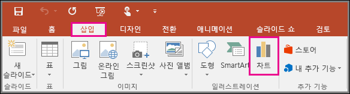
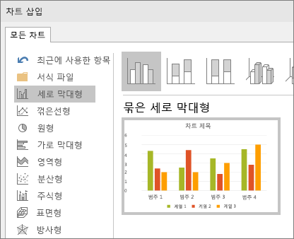
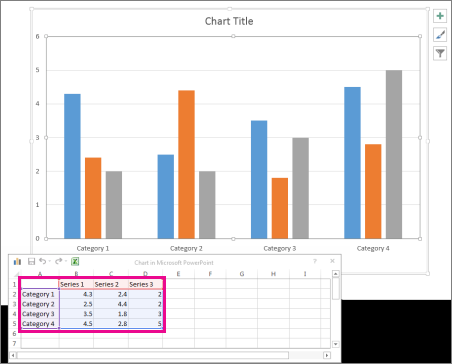

# Power Point, PPT

마이크로소프트에서 지원하는 공식 문서를 참고하여 작성한 PPT 사용법

[공식 문서 링크](https://support.microsoft.com/ko-kr/powerpoint)

  

## 목차

[개체 맞춤 및 정렬](#개체-맞춤-및-정렬)

[차트 및 그래프](#차트-및-그래프)

[그림 배경 제거](#그림-배경-제거)

  

## 개체 맞춤 및 정렬

[공식 문서](https://support.microsoft.com/ko-kr/office/슬라이드에서-개체-정렬-및-정렬-5f961535-a2ae-4914-a24a-94c669903ae3)

유용한 맞춤 옵션, 가이드 및 눈금선을 사용하여 개체를 정렬하여 프레젠테이션을 전문적으로 보이게 한다.

**개체 정렬**

1. 정렬할 개체를 선택한다. `shift`키를 이용해 여러 객체를 선택할 수 있다.
2. **그림 서식** > **맞춤**을 선택해 원하는 옵션을 선택한다.

**안내선 및 눈금선 사용**

  

## 차트 및 그래프

[공식 문서](https://support.microsoft.com/ko-kr/office/프레젠테이션에-차트-및-그래프-사용-c74616f1-a5b2-4a37-8695-fbcc043bf526)

PowerPoint 또는 Excel에서 차트를 만들 수 있다. 차트에 나타낼 데이터의 양이 많은 경우 Excel에서 차트를 만든 다음 프레젠테이션에 복사한다.

데이터가 정기적으로 변경되며 차트에 항상 최신 수치를 반영하려는 경우에도 이 방법을 사용하면 좋다. 이 경우 차트를 문서에 복사하고 붙여넣을 때 원래 Excel 파일에 연결된 상태로 유지한다.

 

1. **삽입** > **차트** 클릭
  

    <figure>
        
    </figure>
  

2. 차트 종류 클릭하고 원하는 차트 두 번 클릭
  

    <figure>
        
    </figure>
  

3. 워크시트가 나타나면 스프레드시트의 개체 틀 데이터를 고유의 정보로 바꿈
  

    <figure>
        
    </figure>
  

**팁**

차트를 삽입하면 차트 오른쪽 위 모서리 옆에 작은 단추가 표시된다. **차트 요소**(플러스 모양) 단추를 사용하여 축 제목 또는 데이터 레이블 같은 요소를 표시하거나 숨기거나 해당 요소에 서식을 지정할 수 있다.

**차트 스타일**(붓 모양)단추를 사용하여 차트 색이나 스타일을 빠르게 변경할 수 있다.

**차트 필터**(깔때기 모양)단추는 차트에 데이터를 표시하거나 숨기는 고급 옵션이다.

  

## 그림 배경 제거

  