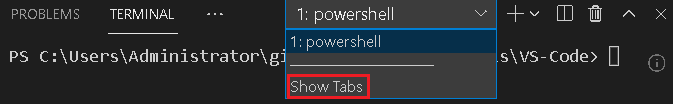
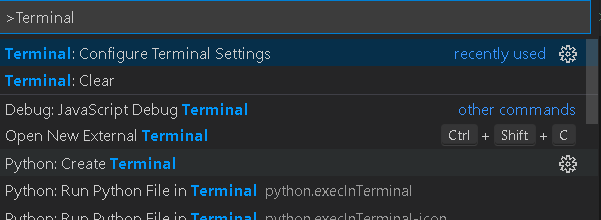
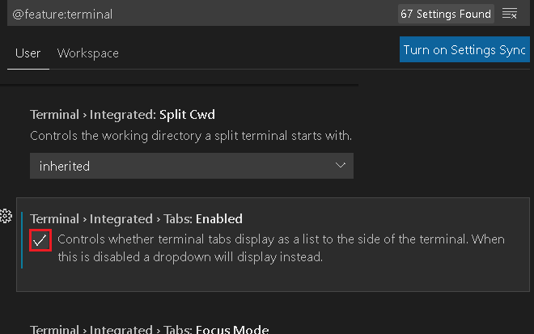

# 터미널
<p>VS Code 터미널 관련 설정에 대해서 다룬다.</p>
<p>bash와 같은 기타 터미널과의 연동에 관한 내용 작성 예정.</p>

<br><br>

## 목차
<p>

- ['Show Tabs' 복구](#'show-Tabs'-복구)
- [Git Bash 연동](#git-bash-연동)
</p>

<br><br>

## 'Show Tabs' 복구
<div align='center'>
  <figure>
    
    <div align="center"><figcation>실수로 'Show Tabs'를 누른 경우</figcation></div>
  </figure>
</div>

<br>

<div align='center'>
  <figure>
    
    <div align="center"><figcation>Ctrl+Shift+P를 눌러 그림과 같이 입력</figcation></div>
  </figure>
</div>

<br>

<div align='center'>
  <figure>
    
    <div align="center"><figcation>스크롤 최하단부 쯤에서 해당 옵션 체크 해제</figcation></div>
  </figure>
</div>

<br><br>

## Git Bash 연동
<p>

이미 Git Bash가 설치되었다고 가정한다. Git Bash를 이용하기 위해 Git을 설치하기 위해서는 [https://git-scm.com](https://git-scm.com) 참조
</p>

<br>

### 1. VS Code에서 terminal.integrated.profiles.windows 설정 보기
<p>

사용자 설정(User Setting)을 열기 위해 `Ctrl` + `,` 단축키 사용

  <div align='center'>
    <figure>
      
      <div align="center"><figcation>사용자 설정 검색창에서 terminal.integrated.profiles.windows 찾기</figcation></div>
    </figure>
  </div>
</p>

<p>

위 화면에서 `Edit in settings.json`을 클릭하면 settings.json 파일이 열리면서, 다음과 같은 코드가 추가된 모습을 확인할 수 있다.

<div align='center'>
    <figure>
      
      <div align="center"><figcation>추가된 설정 코드</figcation></div>
    </figure>
  </div>
</p>

<br>

### 2. settings.json 수정
<p>

`source`와 `path` 중 하나의 인자만 설정하는 것이 좋다고 VS Code가 공식적으로 표명하고 있다. Git Bash에 대한 환경변수가 설정되었다면 커뮤니티에선 위처럼 "Git Bash"를 `source` 인자에 넣어줘도 동작하는 사람들이 다수인 것으로 확인했는데, 필자는 Git 설치 시 default 경로가 아닌 다른 경로에 설치했고 따로 환경변수 설정을 해두지 않아서 그런지 동작하지 않았다.
</p>
<p>

그래서 설정 코드를 다음과 같이 수정하였다. 필자는 PowerShell보다 Bash가 더 익숙해 기본 터미널을 Bash로 바꾸는 설정도 추가하였다.
```json
"terminal.integrated.profiles.windows": {
        "PowerShell": {
            "source": "PowerShell",
            "icon": "terminal-powershell"
        },
        "Command Prompt": {
            "path": [
                "${env:windir}\\Sysnative\\cmd.exe",
                "${env:windir}\\System32\\cmd.exe"
            ],
            "args": [],
            "icon": "terminal-cmd"
        },
        "Git-Bash": {
            "path": ["C:\\dev\\Git\\bin\\bash.exe"],
            "args": [],
            "icon": "terminal-bash"
        },
    },

// Bash를 기본 터미널로 설정
"terminal.integrated.defaultProfile.windows": "Git-Bash",
```
</p>