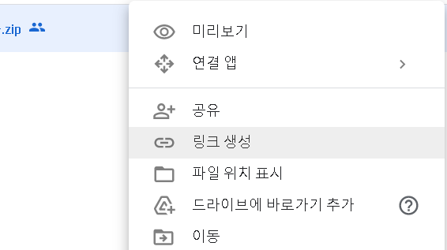
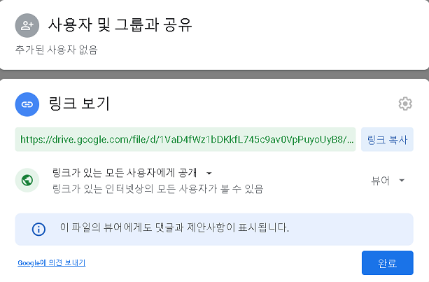

# 드라이브 파일 다운

참조 - [soonbee.log](https://velog.io/@soonbee/%EA%B5%AC%EA%B8%80-%EB%93%9C%EB%9D%BC%EC%9D%B4%EB%B8%8C%EC%97%90-%EC%9E%88%EB%8A%94-%ED%8C%8C%EC%9D%BC%EC%9D%84-%ED%84%B0%EB%AF%B8%EB%84%90%EC%97%90%EC%84%9C-curlwget%EC%9C%BC%EB%A1%9C-%EB%8B%A4%EC%9A%B4%EB%B0%9B%EA%B8%B0)
<br><br>

## 목차
<p>

[1. 파일 ID 가져오기](#1-파일-id-가져오기)
</p>
<p>

[2. 일반 용량 다운로드](#2-일반-용량-다운로드)
</p>
<p>

[3. 큰 용량 다운로드](#3-큰-용량-다운로드)
</p>

<br><br>

## 1. 파일 ID 가져오기
<p>먼저 구글 드라이브에서 다운로드할 파일의 공유 링크를 생성한다.</p>
<p>

```
https://drive.google.com/file/d/<file id>/view?usp=sharing
```
위와 같은 형식으로 생성되며, `<file-id>`에 해당하는 부분이 필요하다.

<div align="center">
  <figure>
      
      <div align="center"><figcation>공유 링크 생성</figcation></div>
  </figure>
</div>

<br>

<div align="center">
  <figure>
      
      <div align="center"><figcation>생성된 공유 링크</figcation></div>
  </figure>
</div>

</p>

<br><br>

## 2. 일반 용량 다운로드
<p>

아래 코드를 직접 입력해도 좋고 스크립트 파일로 만들어 사용해도 좋다. `file_id` 에서는 공유링크를 통해 알아낸 값을 넣고 `file_name` 에는 다운로드 후 저장될 파일의 이름을 작성한다(구글 드라이브에 저장된 파일의 이름과 동일하지 않아도 된다).
</p>

<p>

예시
```
file_id="1O8XjiTnwHZcsrt4TrflbBUn7J7GHMTyy"
file_name="download.file"
wget "https://drive.google.com/uc?export=download&id=${file_id}" -O ${file_name}
```
</p>


<br><br>

## 3. 큰 용량 다운로드
<p>구글 드라이브에서 종종 용량이 큰 파일을 다운로드하는 경우 바이러스 검사를 진행할 수 없다며 정말로 다운로드 하겠냐고 물어보는 화면이 나오는데, 이 때문에 위의 방법들로는 다운로드가 안된다. 스크립트에 변형이 조금 필요하다.</p>
<p>

예시
```
file_id="1O8XjiTnwHZcsrt4TrflbBUn7J7GHMTyy"
file_name="download.file"
curl -sc /tmp/cookie "https://drive.google.com/uc?export=download&id=${file_id}" > /dev/null
code="$(awk '/_warning_/ {print $NF}' /tmp/cookie)"
curl -Lb /tmp/cookie "https://drive.google.com/uc?export=download&confirm=${code}&id=${file_id}" -o ${file_name}
```
</p>

<br><br>