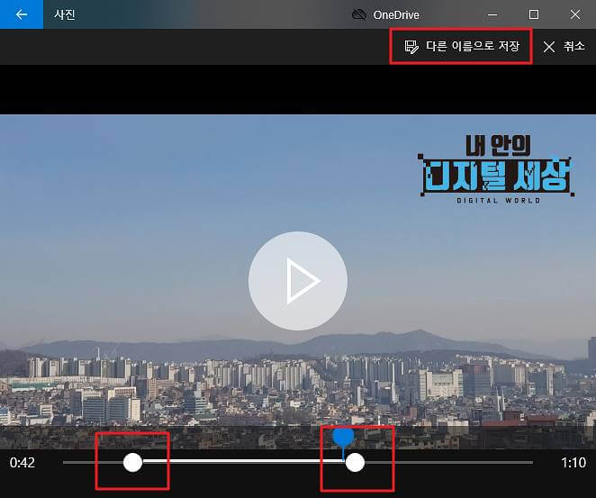

# 동영상 편집

## 동영상 자르기·분할

참조 - [내 안의 디지털 세상](https://prolite.tistory.com/1560)

 

  

    <figure>
        
    </figure>
  

  

    <figure>
        
    </figure>
  

  

    <figure>
        
    </figure>
  

  

    <figure>
        
    </figure>
  

  

    <figure>
        
    </figure>
  

  

## 동영상 합치기

  

    <figure>
        
        
<figcation>윈도우 사진 앱 실행</figcation>

    </figure>
  

 

  

    <figure>
        
    </figure>
  

  

    <figure>
        
        
<figcation>사진 - 새 비디오 만들기</figcation>

    </figure>
  

 

  

    <figure>
        
        
<figcation>비디오 합치고 저장</figcation>

    </figure>
  

